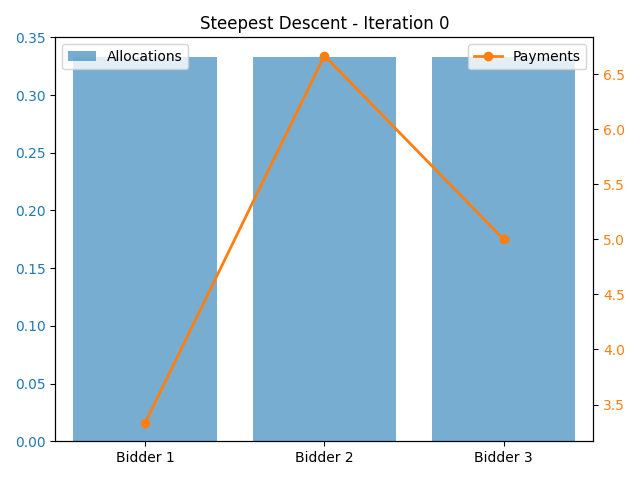
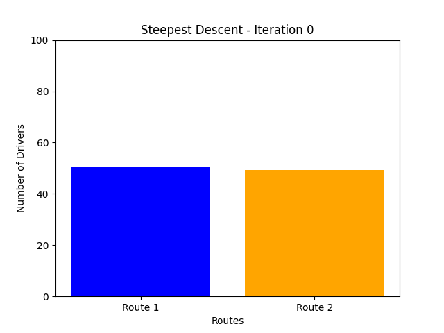
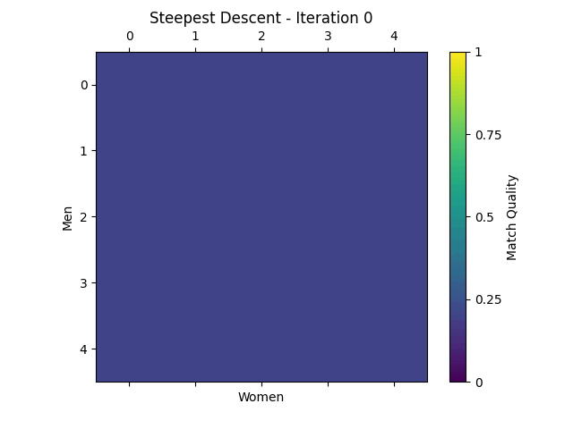

# Introduction to Optimization: Optimization Techniques in Game Theoretic Problems

[](https://www.python.org/downloads/) 
[](https://opensource.org/licenses/MIT)

## Table of Contents


1. [Overview](#overview)
2. [Dependencies](#dependencies)
3. [Code Architecture](#code-architecture)
4. [Theory and Implementations](#theory-and-implementations)
5. [Results and Discussion](#results-and-discussion)
6. [Future Directions](#future-directions)

## Overview

This project is designed for researchers and practitioners interested in the intersection of numerical optimization and game-theoretic analysis. It provides a structured framework for analyzing equilibrium conditions and optimal allocations in strategic settings using continuous optimization techniques. The repository presents a collection of optimization-driven implementations for three classical game-theoretic problems:

- **Auction Design:** Optimizing revenue in auctions by allocating a divisible good among multiple bidders while enforcing individual rationality and allocation constraints.

- **Congestion on Networks:** Modeling route-choice behavior among drivers with congestion-dependent latency functions to determine an equilibrium distribution.

- **Stable Matching:** Formulating a continuous relaxation of the assignment problem to compute near-optimal matchings between two sets (e.g., men and women) while enforcing one-to-one pairing constraints.

Each problem is formulated as a continuous optimization task where objective functions are minimized using numerical techniques—primarily the Steepest Descent and Newton's Methods. Analytical solutions or benchmarks (such as the Hungarian algorithm for stable matching) are used to validate the numerical results.

## Dependencies

### Core Requirements
| Package | Version |
|---------|---------|
| Python  | ≥3.8    |
| NumPy   | ≥1.21.0 |
| SciPy   | ≥1.7.0  |
| pandas  | ≥2.0.0 |
| Matplotlib | ≥2.2.3 |

To install all required packages, run:

```bash
pip install -r requirements.txt
```

## Code Architecture

```sh
./
├── auction_game.py        # Auction design implementation
├── congestion_game.py     # Congestion on networks implementation
├── main.py                # The driver code for the results
├── matching_game.py       # Stable matching implementation
├── optimization.py        # Shared optimization routines
├── README.md              # Project documentation
├── requirements.txt       # Project requirements
└── visualization.py       # Visualization tools
```

The `main.py` script serves as the central driver for the project, coordinating the execution of different game-theoretic experiments based on command-line arguments. It directs the flow of execution by calling the appropriate optimization routines from `optimization.py` and subsequently invokes `visualization.py` to generate convergence plots and other relevant visual outputs. This modular design ensures a reproducible workflow and facilitates a clear demonstration of the algorithmic performance across various problem settings.

## Theory and Implementations

### Problem I: Auction Design

#### Problem Formulation

We consider an auction setting where an auctioneer allocates a divisible good to $n$ bidders, each possessing a private valuation $v_i$. The auctioneer determines the allocation $x_i$ (the fraction of the good assigned to bidder $i$). Payments are computed at the end as $p_i = x_i v_i$. The objective is to maximize total revenue:
```math
R = \sum_{i=1}^{n} p_i = \sum_{i=1}^{n} \max{(0, x_i v_i)}
```
Since conventional optimization routines are designed for minimization, the problem is reformulated by minimizing the negative revenue with added penalty terms to enforce feasibility constraints:
```math
\Phi(x) = -\sum_{i=1}^{n} \max{(0, x_i v_i)} + \frac{\mu}{2} \text{ (Penalty Terms)}
```
where $\mu$ is a penalty parameter enforcing the constraints.

The design also imposes key constraints:

- **Allocation Constraints:** Each allocation $x_i$ must be in $[0,1]$.

- **Total Allocation Constraint:** The total allocation must satisfy $\sum_{i=1}^{n} x_i \leq 1$.

The analytical optimal solution is obtained by allocating the entire good to the bidder with the highest valuation, i.e., if $i^\ast = \arg\max(v_i)$ then set $x_{i^\ast} = 1$ and $p_{i^\ast} = v_{i^\ast}$ (with all other $x_i$ and $p_i$ set to zero), yielding $R^\ast = \max(v_i)$.

Numerical optimization is performed using both the Steepest Descent and Newton’s Methods. These routines iteratively minimize the potential function, with parameters such as the step size (`alpha`), convergence tolerance (`tol`), and maximum iterations adjusted to ensure reliable convergence. The numerical solution is then compared against the analytical optimal allocation to evaluate performance.

#### Implementation Usage

Execute the script from the command line. For example, to run the auction design for three bidders with valuations 10, 20, and 15, use:  

```sh
python main.py auction --valuations "10,20,15"
```  

Command-line arguments include: 

- `--valuations`: Comma-separated list of bidder valuations (e.g., `"10,20,15"`).  
- `--mu`: Penalty coefficient (default: `10.0`).  
- `--alpha`: Step size for steepest descent (default: `0.001`).  
- `--tol`: Convergence criterion (default: `1e-6`).  
- `--max_iter`: Maximum iterations for steepest descent (default: `1000`).  
- `--max_iter_newton`: Maximum iterations for Newton’s method (default: `100`).  

For example, to use custom parameters, run:  

```sh
python main.py auction --valuations "15,25,30" --mu 200 --alpha 0.005 --tol 1e-8
```  

---

### Problem II: Congestion on Networks

#### Problem Formulation

We consider a congestion game with two routes, each having latency functions:

```math
L_1(x) = a_1 x + b_1, \quad L_2(x) = a_2 x + b_2.
```
Drivers are allocated between these routes, and equilibrium is determined by minimizing:
```math
\Phi(x) = \frac{1}{2} a_1 x^2 + b_1 x + \frac{1}{2} a_2 (N - x)^2 + b_2 (N - x).
```
where $x$ is the number of drivers on Route 1. The analytical equilibrium is obtained by setting the derivative to zero, leading to  
```math
(a_1 + a_2)x = a_2 N + b_2 - b_1,
```
and therefore,  
```math
x^\ast = \frac{a_2 N + b_2 - b_1}{a_1 + a_2}.
```

The potential function is minimized using numerical optimization techniques—specifically, the Steepest Descent and Newton’s Methods—to determine the optimal distribution of drivers. As with the auction design, penalty functions and convergence parameters (`alpha`, `tol`, `max_iter`, etc.) are tuned to ensure that the algorithm converges to the analytical equilibrium. The computed equilibrium distribution is then compared with the expected analytical result.

#### Implementation Usage

Run the congestion game script from the terminal. For example, to simulate 100 drivers with specified latency parameters, execute:

```sh
python main.py congestion --N 100 --a1 1.0 --b1 0.0 --a2 2.0 --b2 10.0
``` 

Command-line arguments include:

- `--N`: Number of drivers (default: `100`).  
- `--a1`, `--b1`: Parameters for Route 1's latency function.  
- `--a2`, `--b2`: Parameters for Route 2's latency function.  
- `--alpha`: Step size for steepest descent (default: `0.01`).  
- `--tol`: Convergence tolerance (default: `1e-8`).  
- `--max_iter`: Maximum iterations for steepest descent (default: `1000`).  
- `--max_iter_newton`: Maximum iterations for Newton’s method (default: `100`).

---

### Problem III: Stable Matching

#### Problem Formulation

We consider a matching market with **n men** and **n women**. A cost matrix $C$ of size $n \times n$ is provided, where $C[i,j]$ represents the cost (or dissatisfaction) of matching man $i$ with woman $j$. The goal is to minimize the total matching cost subject to assignment constraints (each man is matched to exactly one woman, and vice versa) and feasibility bounds (each element $X[i,j]$ of the assignment matrix must lie within $[0, 1]$). The continuous formulation defines the potential function as:  
```math
\Phi(x) = \langle C, X \rangle + \frac{\lambda}{2} \|x\|^2 + \frac{\mu}{2}\Biggl[ \sum_{i=1}^{n} \Bigl(\sum_{j=1}^{n} X_{ij} - 1\Bigr)^2 + \sum_{j=1}^{n} \Bigl(\sum_{i=1}^{n} X_{ij} - 1\Bigr)^2 + \sum_{i,j}\Bigl(\max(0, -X_{ij})^2 + \max(0, X_{ij}-1)^2\Bigr) \Biggr],
```
where $\langle C, X \rangle$ denotes the total matching cost, $\lambda$ is a regularization parameter ensuring strict convexity, and $\mu$ is a penalty parameter enforcing the matching constraints. The analytical optimal solution is obtained via the Hungarian algorithm, which computes a binary assignment matrix $X^\ast$ that minimizes $\langle C, X^\ast \rangle$ under the one-to-one matching constraints.

The potential function for the stable matching problem is minimized using numerical optimization techniques—Steepest Descent and Newton’s Methods. The implementation integrates penalty terms to enforce the assignment and bound constraints, and uses a regularization parameter $\lambda$ for convexity. The continuous solution is then compared against the optimal binary matching computed using the Hungarian algorithm (via `scipy.optimize.linear_sum_assignment`).

#### Implementation Usage

Run the stable matching script from the command line. For instance, to run with a randomly generated $5\times5$ cost matrix, simply execute:

```sh
python main.py matching
```

To run with a custom cost matrix from a CSV file (where each row represents a man and each column a woman), use:

```sh
python main.py matching --n 4 --cost_file cost_matrix.csv
```

An example `cost_matrix.csv` might contain:

```csv
3.2, 1.5, 4.8, 2.0
2.1, 3.0, 1.2, 4.5
4.5, 2.3, 3.7, 1.8
1.0, 4.2, 2.5, 3.3
```

Additional command-line arguments include:

- `--n`: Number of men/women (matrix size, default: `5`).  
- `--cost_file`: Path to a CSV file containing the cost matrix.  
- `--mu`: Penalty parameter enforcing assignment constraints (default: `1000.0`).  
- `--lam`: Regularization parameter ensuring strict convexity (default: `0.01`).  
- `--alpha`: Step size for steepest descent (default: `0.001`).  
- `--tol`: Convergence tolerance (default: `1e-6`).  
- `--max_iter`: Maximum iterations for steepest descent (default: `2000`).  
- `--max_iter_newton`: Maximum iterations for Newton’s method (default: `100`).  
- `--seed`: Random seed for reproducibility (default: `42`).

For example, to adjust parameters, run:

```sh
python matching_game.py --n 6 --mu 2000 --lam 0.2 --alpha 0.0005 --max_iter 5000
```

### Enhancements in Optimization Methods

To improve numerical stability and solution feasibility, we have introduced the following enhancements:

- **Backtracking Line Search in Steepest Descent:** This dynamically adjusts the step size to ensure descent and avoid instability.

- **Projection in Steepest Descent and Newton’s Method:** This ensures that the iterates remain within feasible bounds, improving convergence behavior.

- **Regularization in Newton’s Method:** When the Hessian is not invertible, a small regularization term is added to improve numerical stability and ensure well-conditioned updates.

These modifications result in improved convergence rates, better constraint satisfaction, and enhanced robustness in optimization problems with ill-conditioned Hessians.

## Results and Discussion

### Auction Design

For the auction design problem, our initial implementation using the standard steepest descent method on a vector containing both allocations and payments resulted in a high error rate, while Newton’s method failed due to the Hessian matrix being non-invertible.

To resolve these issues:
- We removed the payments from the optimization vector, avoiding redundancy and unnecessary constraints.
- We added a regularization term to the Hessian to ensure invertibility.
- We applied a projection technique after each optimization step to maintain feasibility.

These improvements significantly enhanced performance. Newton’s method successfully reached the optimal solution, and steepest descent achieved a near-optimal solution with minimal error.

#### Auction Game Results

| Method             | Iterations | Error (%) |
|--------------------|------------|-----------|
| **Steepest Descent** | 202        | 19.45  |
| **Newton's Method** | max_iter | 0.00 |

#### Visualizations

<p align="center">
  
  
</p>

---

### Congestion on Network

In the congestion game, both methods successfully converged to the expected equilibrium. However, Newton’s method required significantly fewer iterations compared to steepest descent.

#### Congestion Game Results

| Method             | Iterations | Error (%) |
|--------------------|------------|-----------|
| **Steepest Descent** | 590        | 0.000007  |
| **Newton's Method** | 11         | 0.000007  |

#### Visualizations

<p align="center">
  
  
</p>

---

### Stable Matching

Initially, the steepest descent method struggled to maintain feasibility, often producing values outside the valid range [0,1]. To address this:
- We increased the penalty coefficient `mu` significantly (around 100) to enforce feasibility.
- We implemented a backtracking algorithm to dynamically adjust the step size `alpha`.
- For Newton’s method, we added a projection technique after each step to ensure solutions remain feasible.

Despite these improvements, convergence was slow, particularly for steepest descent, which required a large number of iterations.

#### Stable Matching Results

| Method             | Iterations | Error (%) |
|--------------------|------------|-----------|
| **Steepest Descent** | max_iter | 70.16 |
| **Newton's Method** | max_iter | 21.42 |

#### Visualizations

<p align="center">
  
  
</p>

---

### Summary

Our experiments demonstrate the strengths and weaknesses of each optimization technique across different game-theoretic problems:
- **Newton’s method** generally converged faster but required modifications (regularization and projection) to ensure stability and feasibility.
- **Steepest descent** was more robust but slower, often requiring parameter tuning (e.g., backtracking step size adjustment).
- **Projection techniques** improved feasibility in constrained optimization problems, particularly in the stable matching and auction design problems.

These results underscore the importance of tailoring optimization methods to problem structure, using problem-specific adjustments to enhance convergence and solution quality.


## Future Directions

Advancing the current framework can be approached along several complementary axes:

- **Parameter Tuning:**
Future work will explore adaptive strategies for dynamically adjusting penalty parameters ($\mu$) and regularization terms ($\lambda$). Such adaptive schemes could automatically balance the trade-off between constraint enforcement and objective minimization, thereby enhancing convergence rates and solution accuracy.

- **Algorithmic Enhancements:**
The incorporation of advanced optimization techniques is a promising avenue. Implementing quasi-Newton methods (e.g., BFGS and L-BFGS) and integrating trust-region frameworks could provide improved convergence behavior, particularly in problems where the Hessian information is unreliable. Additionally, exploring variants of stochastic gradient descent may prove beneficial in handling large-scale or noisy optimization scenarios.

- **Model Extensions:**
Extending the current models to more complex real-world applications is an important direction. Potential extensions include multi-item auctions with combinatorial bids, network games that involve multiple origin-destination pairs, and many-to-many matching markets. Moreover, developing robust post-processing methods to round continuous solutions into feasible binary assignments will enhance the practical applicability of the matching framework.

- **Computational Enhancements:**
To address scalability issues, future efforts could focus on parallel implementations and GPU acceleration (e.g., using CuPy) to manage large-scale problems more efficiently. Such computational improvements would allow the framework to be applied to higher-dimensional and more computationally intensive problems without compromising performance.

This structured optimization framework provides a foundation for analyzing equilibrium problems with numerical techniques, bridging the gap between game theory and optimization.